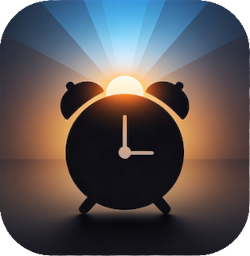

# hass-wake-alarm

Sunrise wake-up alarms for Home Assistant. Lights ramp up before alarm
time, music fades in at alarm time. Multi-instance, multi-room, custom
Lovelace card included.

**Tested with:** Philips Hue lights, Sonos speakers, and the iOS
Companion app. Not tested on Android or with other light / media-player
integrations — should work everywhere HA supports the underlying
`light.turn_on` and `media_player.play_media` services, but YMMV.

## Install

1. HACS → ⋮ → Custom repositories → add `https://github.com/scootaash/hass-wake-alarm` with category **Integration**.
2. HACS → Wake Alarm → Download.
3. Restart Home Assistant.
4. Settings → Devices & Services → Add Integration → search "Wake Alarm".
5. Set up the instance with the wizard to select which media player and lights are used. If desired add notification and presence
6. Add the card and select a playlist. Adjust other settings if desired

The card ships **inside the integration** and registers itself as a
Lovelace resource at `/wake_alarm/wake-alarm-card.js`. There's no
separate HACS Dashboard install or manual `Settings → Dashboards →
Resources` step.


## Default card

```yaml
type: custom:wake-alarm-card
entity: switch.my_alarm_enabled
```

Pass any wake_alarm enabled-switch as `entity` and the card derives
every related entity from the same config entry.

## Alarm Card options


The card shows a large off/on button, a time select with rocker switches to select the time and days of the week switches to control which days the alarm will sound. 


Clicking the cog takes you to the setup page to adjust:
1. Settings for the alarm logic
2. Run test patterns
3. Select a media source
4. Shows targets set in setup wizard

## How it works

Every example below uses `my_alarm` as the slug — replace with whatever
slug HA derived from your alarm's name.

### Standard cycle

1. **Schedule.** The integration computes the next fire time from
   `time.my_alarm_alarm_time` and whichever day toggles are on, then
   arms a single one-shot timer for `alarm_time − length_min`. No
   minute-by-minute polling.
2. **Ramp start** (`alarm_time − length_min`). State goes to `ramping`.
   The configured lights turn on at 1% brightness / `start_kelvin` and
   step linearly up to `max_brightness_pct` / `target_kelvin` over
   `length_min × steps_per_min` steps (default 20 steps/min). The ramp
   never dims a light below its current brightness — if you manually
   brighten a bedroom light mid-ramp it stays brightened.
3. **Music start** (`alarm_time`). State goes to `playing`. For a
   single speaker the integration sets volume to 0, `play_media`'s the
   selected favourite or playlist, then fades volume from 0 to the
   configured target across `music_fade_sec`. For multiple Sonos
   speakers the same sequence runs synchronously across the group,
   with all the join / shuffle / settle-delay quirks Sonos requires.
4. **Random track-skip.** After the queue starts, the music sequence
   skips 1–4 tracks forward so each alarm and each snooze begins on a
   different track from the favourite, not always track 1.
5. **End.** Music plays until you dismiss, snooze, or the auto-dismiss
   timer fires (if `auto_dismiss_min` is configured > 0). When state
   returns to `idle` the integration recomputes the next fire
   automatically — `sensor.my_alarm_next_alarm` jumps forward to the
   following enabled day.

If you (or another automation) change a configured light's brightness
during the ramp using a different context, the ramp ends immediately —
assumed to be an external override.

### Presence

Set the optional **Presence** entity in the integration's setup wizard
(or via Configure later) to gate the whole cycle on someone being home.
If their state isn't `home` at the moment the ramp would start, the
alarm is silently skipped and the schedule rolls forward to the next
enabled day. No notification, no light, no music. Useful for "alarm
only if I'm in the house" — leave it blank to skip the check entirely.

### Snooze and Dismiss

Both actions are available on the card's main view, in the mobile
notification action buttons, and via the `wake_alarm.snooze` /
`wake_alarm.dismiss` services. They render on the main view only while
`binary_sensor.my_alarm_active` is `on`.

- **Snooze.** Pauses music on the active player or group, cancels the
  ramp/music tasks, transitions to `snoozing`, and arms a timer for
  `snooze_min` minutes. When it fires, the music sequence re-runs
  (skipping the Sonos group-join preamble since the group is already
  formed) and a different random track plays. Lights are left alone.
  The mode tile shows a `Music in M:SS` countdown during the snooze.
- **Dismiss.** Stops music on every configured player, unjoins any
  group, cancels every pending timer (ramp, snooze, auto-dismiss,
  scheduled music start), drops to `idle`, and reschedules the next
  fire. Lights stay where they are — useful if they've ramped up and
  you don't want them yanked back to off.

`button.my_alarm_cancel_ramp` (also surfaced on the main view during
ramping) stops the light ramp without dismissing the alarm — music
will still play at `alarm_time`.

### Notifications

Mobile notifications are optional but designed so you can snooze or
dismiss from the lock screen.

**Standard notification** fires once at `alarm_time` when music starts,
to `notify_target_standard`. Title is the instance name + "Alarm"; the
body is short and includes two action buttons (Snooze, Dismiss) that
call back into the `wake_alarm.*` services with the right entity
encoded so multi-instance setups don't collide. On iOS this delivers
with `interruption-level: active`; on Android it uses the
`wake_alarm_standard` channel at default importance, so you can
customise the channel's sound separately from your other HA
notifications.

**Urgent notification** is the fallback when `notify_target_urgent` is
configured AND the music can't actually start at `alarm_time`. Two
cases:

- One of the configured media players is `unavailable` (powered off,
  network issue): "Lights are on but {player} couldn't play. Wake up."
- No media has been picked yet via the card: "Lights are on but no
  media is configured. Open the alarm card to pick what to play."

iOS gets `push.sound.critical: 1` plus `interruption-level: critical`,
which bypasses Do Not Disturb and silent mode and rings at full volume
even on a muted phone. Android uses the separate `wake_alarm_urgent`
channel at HIGH importance so you can assign it a louder / more
alarming sound than the standard channel. Both notifications carry the
same Snooze + Dismiss action buttons.

Two **Test** buttons in the card's settings (Test standard
notification, Test urgent notification) fire each path on demand so
you can verify the sound and interruption-level on your actual device
before relying on it for a real alarm.

## Building your own dashboard

Every example below assumes you named your alarm **My Alarm** at setup,
which gives a slug of `my_alarm`. Replace `my_alarm` with whatever slug
HA derived from your instance name.

Each alarm instance creates a fixed set of entities all of which can be
used in any standard HA card (entities, gauges, buttons, conditional
cards, automations…).

### Switches

- `switch.my_alarm_enabled` — master enable; toggle to arm/disarm
- `switch.my_alarm_d1_mon` … `switch.my_alarm_d7_sun` — day-of-week toggles
  (the `dN_` prefix gives calendar order in HA's device card)

### Time + numbers (all writable via UI)

- `time.my_alarm_alarm_time`
- `number.my_alarm_length_min` (1–120)
- `number.my_alarm_start_kelvin` (1500–6500)
- `number.my_alarm_target_kelvin` (1500–6500)
- `number.my_alarm_max_brightness_pct` (1–100)
- `number.my_alarm_volume` (0.0–1.0)
- `number.my_alarm_snooze_min` (1–30)
- `number.my_alarm_steps_per_min` (5–60)
- `number.my_alarm_music_fade_sec` (0–300)
- `number.my_alarm_auto_dismiss_min` (0–120, 0 disables)

### Action buttons

Press via `button.press` service or tap in the UI:

- `button.my_alarm_test_light_ramp`
- `button.my_alarm_test_music`
- `button.my_alarm_test_standard_notification`
- `button.my_alarm_test_urgent_notification`
- `button.my_alarm_cancel_ramp`
- `button.my_alarm_dismiss`
- `button.my_alarm_snooze`

### Status

- `sensor.my_alarm_next_alarm` — timestamp of the next scheduled fire.
  Attributes: `light_entities`, `media_player_entities`, `person_entity`.
- `sensor.my_alarm_state` — enum: `idle` / `ramping` / `playing` / `snoozing`.
  When `snoozing`, attribute `snooze_until` is the ISO timestamp the
  music will resume.
- `sensor.my_alarm_media_selection` — friendly title of the picked media,
  or `none`. Attributes: `media_content_id`, `media_content_type`,
  `thumbnail`.
- `binary_sensor.my_alarm_active` — on whenever a sequence is running
  (any state other than `idle`).

### Services

- `wake_alarm.snooze` (target = any wake_alarm entity)
- `wake_alarm.dismiss`
- `wake_alarm.cancel_ramp`
- `wake_alarm.test_light_ramp`
- `wake_alarm.test_music`
- `wake_alarm.test_standard_notification`
- `wake_alarm.test_urgent_notification`
- `wake_alarm.set_media` — persists the picked media for an alarm; called
  by the card after the user picks via the media browser. Fields:
  `media_content_id`, `media_content_type`, `title`, `thumbnail`.

### Example automation

Auto-dismiss the alarm if you leave home while it's still running
(useful if you snoozed and walked out):

```yaml
alias: "Wake Alarm: dismiss if I leave home while it's running"
trigger:
  - platform: state
    entity_id: person.me
    to: not_home
condition:
  - condition: state
    entity_id: binary_sensor.my_alarm_active
    state: "on"
action:
  - service: wake_alarm.dismiss
    target:
      entity_id: switch.my_alarm_enabled
```
